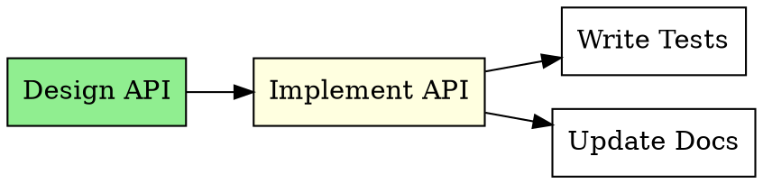

# Dependency Commands

Commands for managing task dependencies and relationships.

## Add Dependency

Create a dependency between tasks.

```bash
tf dep add SOURCE TARGET [OPTIONS]
```

The SOURCE task blocks/relates-to the TARGET task.

### Options

| Option | Short | Description |
|--------|-------|-------------|
| `--type` | `-t` | Dependency type |

### Dependency Types

| Type | Description |
|------|-------------|
| `blocks` | Hard dependency (default) - SOURCE must complete before TARGET |
| `related` | Soft link - Reference between related tasks |
| `parent-child` | Hierarchical relationship |
| `discovered-from` | Traceability - Track where a task originated |

### Examples

```bash
# Design must complete before implementation
tf dep add tf-design tf-implement

# Explicit blocking dependency
tf dep add tf-design tf-implement --type blocks

# Related tasks (soft link)
tf dep add tf-bug1 tf-bug2 -t related

# Track origin
tf dep add tf-issue123 tf-task456 -t discovered-from
```

## Remove Dependency

Remove a dependency between tasks.

```bash
tf dep remove SOURCE TARGET
```

### Examples

```bash
tf dep remove tf-design tf-implement
```

## View Dependency Tree

Show dependencies for a task.

```bash
tf dep tree TASK_ID [OPTIONS]
```

### Options

| Option | Description |
|--------|-------------|
| `--depth` | Maximum depth to display |
| `--all` | Include all dependency types |

### Output

```
tf-implement
├── blocked by:
│   └── tf-design (closed)
│       └── tf-research (closed)
└── blocks:
    ├── tf-test (open)
    │   └── tf-deploy (open)
    └── tf-docs (open)
```

## Find Ready Tasks

Find tasks with no open blocking dependencies.

```bash
tf ready [OPTIONS]
```

A task is "ready" when:
- Status is `open`
- All blocking dependencies are `closed`
- Not a Plan (Plans can't be executed directly)

### Options

| Option | Short | Description |
|--------|-------|-------------|
| `--type` | `-t` | Filter by type |
| `--priority` | `-p` | Filter by priority |
| `--assignee` | `-a` | Filter by assignee |
| `--label` | `-l` | Filter by label |
| `--limit` | `-n` | Max results |

### Examples

```bash
# All ready tasks
tf ready

# Ready bugs
tf ready -t bug

# Ready high-priority
tf ready -p 0,1

# Top 5 ready tasks
tf ready -n 5
```

## Dependency Graph

Generate a visual dependency graph.

```bash
tf admin graph [OPTIONS]
```

### Options

| Option | Description |
|--------|-------------|
| `--format` | Output format (dot, svg, png) |
| `--output` | Output file path |
| `--filter` | Filter expression |

### Examples

```bash
# Generate DOT format to stdout
tf admin graph

# Generate SVG file
tf admin graph --format svg --output deps.svg

# Generate PNG file
tf admin graph --format png --output deps.png

# Filter by status
tf admin graph --filter "status=open"
```

### DOT Output



## Common Patterns

### Sequential Workflow

Tasks that must be done in order:

```bash
tf create "Step 1: Research"
tf create "Step 2: Design"
tf create "Step 3: Implement"
tf create "Step 4: Test"

tf dep add tf-step1 tf-step2
tf dep add tf-step2 tf-step3
tf dep add tf-step3 tf-step4
```

```
Research → Design → Implement → Test
```

### Parallel Tasks with Sync Point

Multiple tasks that converge:

```bash
tf create "Frontend work"
tf create "Backend work"
tf create "Integration"

tf dep add tf-frontend tf-integration
tf dep add tf-backend tf-integration
```

```
Frontend ─┐
          ├→ Integration
Backend  ─┘
```

### Feature with Prerequisites

A feature that requires setup first:

```bash
tf create "Add payment support" -t feature
tf create "Set up Stripe account"
tf create "Get API keys"
tf create "Implement payment flow"

tf dep add tf-stripe tf-implement
tf dep add tf-keys tf-implement
```

```
Stripe Account ─┐
                ├→ Implement Payment
Get API Keys  ──┘
```

### Epic with Subtasks

Breaking down a large task:

```bash
tf create "User Authentication" -t epic
tf create "Login page" --parent tf-auth
tf create "Logout" --parent tf-auth
tf create "Password reset" --parent tf-auth

# Login before logout
tf dep add tf-login tf-logout
```

## Validation

TrakFlow validates dependencies:

| Rule | Error |
|------|-------|
| No self-reference | "Cannot add dependency to itself" |
| Tasks must exist | "Task not found: {id}" |
| No cycles (optional) | "Creates circular dependency" |

### Cycle Detection

TrakFlow can detect circular dependencies:

```bash
# This would create a cycle: A → B → C → A
tf dep add tf-c tf-a
# Warning: Creates circular dependency
```

## Query Dependencies

### Find Blocked Tasks

```bash
tf list --status blocked
```

### Find Tasks Blocking Others

```bash
tf dep tree tf-abc123
```

### Find Orphan Tasks

Tasks with no dependencies:

```bash
tf admin analyze
```

## Impact on Operations

### Closing Tasks

When you close a task, dependent tasks may become ready:

```bash
tf close tf-design
# tf-implement is now ready (if it was only blocked by tf-design)
```

### Reopening Tasks

Reopening a task re-blocks its dependents:

```bash
tf reopen tf-design
# tf-implement is blocked again
```

## Best Practices

1. **Keep graphs simple** - Avoid overly complex chains
2. **Use meaningful types** - Choose the right dependency type
3. **Document why** - Add notes explaining dependencies
4. **Review regularly** - Clean up stale dependencies
5. **Check for cycles** - Before adding dependencies
6. **Don't over-connect** - Not everything needs to be linked
7. **Use labels for grouping** - Instead of `related` dependencies for categorization
