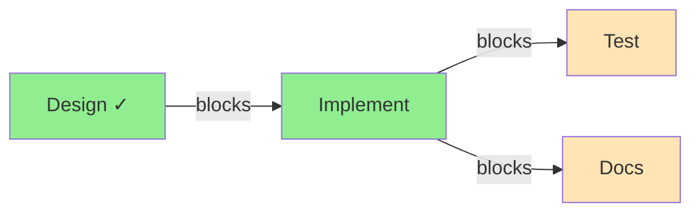
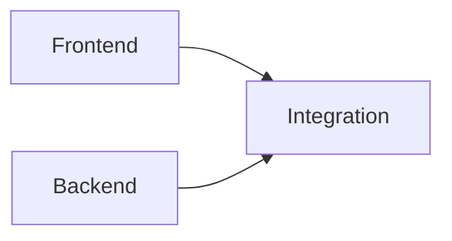
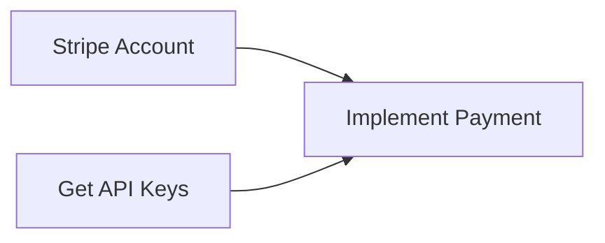

# Dependencies

TrakFlow maintains a dependency graph to track relationships between tasks.

## Dependency Types

| Type | Description | Use Case |
|------|-------------|----------|
| `blocks` | Hard dependency (default) | Task A must complete before Task B |
| `related` | Soft link | Reference between related tasks |
| `parent-child` | Hierarchical | Subtask relationship |
| `discovered-from` | Traceability | Track where a task originated |

## Adding Dependencies

### Basic Syntax

```bash
tf dep add SOURCE TARGET [--type TYPE]
```

The source task blocks/relates-to the target task.

### Examples

```bash
# Design must complete before implementation
tf dep add tf-design tf-implement

# Specify dependency type
tf dep add tf-design tf-implement --type blocks
tf dep add tf-bug1 tf-bug2 -t related
```

## Removing Dependencies

```bash
tf dep remove SOURCE TARGET
```

## Viewing Dependencies

### Dependency Tree

```bash
tf dep tree tf-implement
```

Output:

```
tf-implement
├── blocked by:
│   └── tf-design (open)
└── blocks:
    ├── tf-test (open)
    └── tf-deploy (open)
```

### Dependency Graph

Generate a visual graph:

```bash
tf admin graph
tf admin graph --format svg --output deps.svg
```

## Ready Work Detection

Find tasks with no open blockers:

```bash
tf ready
```

A task is "ready" when:
- Status is `open`
- All blocking dependencies are `closed`
- Not a Plan (Plans can't be executed directly)

### How It Works



In this example:
- Design is closed (✓)
- Implement is **ready** (no open blockers)
- Test and Docs are NOT ready (blocked by Implement)

## Common Patterns

### Sequential Workflow

```bash
tf create "Step 1: Research"
tf create "Step 2: Design"
tf create "Step 3: Implement"
tf create "Step 4: Test"

tf dep add tf-step1 tf-step2
tf dep add tf-step2 tf-step3
tf dep add tf-step3 tf-step4
```


### Parallel Tasks with Sync Point

```bash
tf create "Frontend work"
tf create "Backend work"
tf create "Integration"

tf dep add tf-frontend tf-integration
tf dep add tf-backend tf-integration
```



### Feature with Prerequisites

```bash
tf create "Add payment support" -t feature
tf create "Set up Stripe account"
tf create "Get API keys"
tf create "Implement payment flow"

tf dep add tf-stripe tf-implement
tf dep add tf-keys tf-implement
```



## Dependency Validation

TrakFlow validates dependencies:

| Rule | Error |
|------|-------|
| No self-reference | Can't add dependency to itself |
| Tasks must exist | Both source and target must exist |
| No cycles (optional) | Prevents circular dependencies |

### Cycle Detection

```bash
# This would create a cycle: A → B → C → A
tf dep add tf-c tf-a

# Warning: Creates circular dependency
```

## Querying Dependencies

### Find Blocked Tasks

```bash
tf list --status blocked
```

### Find Tasks Blocking Others

```bash
# Show what a task blocks
tf dep tree tf-abc123
```

### Find Orphan Tasks

Tasks with no dependencies:

```bash
tf admin analyze
```

## Impact on Operations

### Closing Tasks

When you close a task, dependent tasks may become ready:

```bash
tf close tf-design
# tf-implement is now ready (if it was only blocked by tf-design)
```

### Reopening Tasks

Reopening a task re-blocks its dependents:

```bash
tf reopen tf-design
# tf-implement is blocked again
```

## Best Practices

### Dependency Guidelines

1. **Keep graphs simple** - Avoid overly complex dependency chains
2. **Use meaningful types** - Choose the right dependency type
3. **Document relationships** - Add notes explaining why dependencies exist
4. **Review regularly** - Clean up stale dependencies

### Avoiding Issues

1. **Check for cycles** - Before adding dependencies
2. **Don't over-connect** - Not everything needs to be linked
3. **Use labels for grouping** - Instead of `related` dependencies
4. **Keep chains short** - Long chains slow progress
