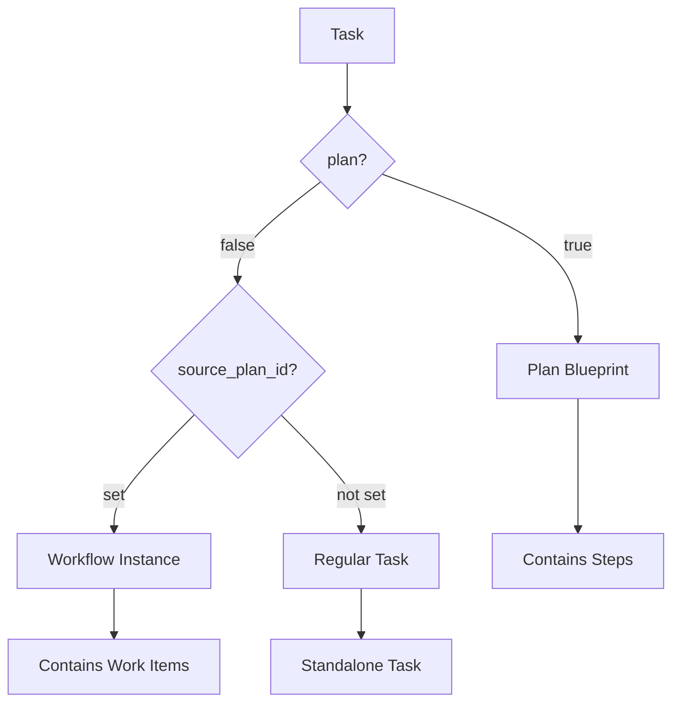
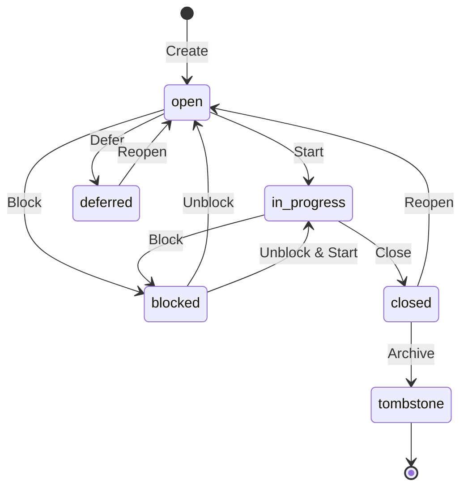
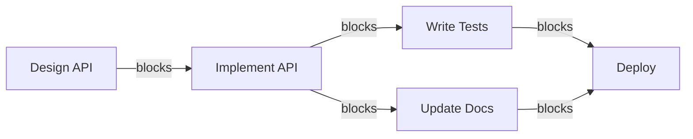
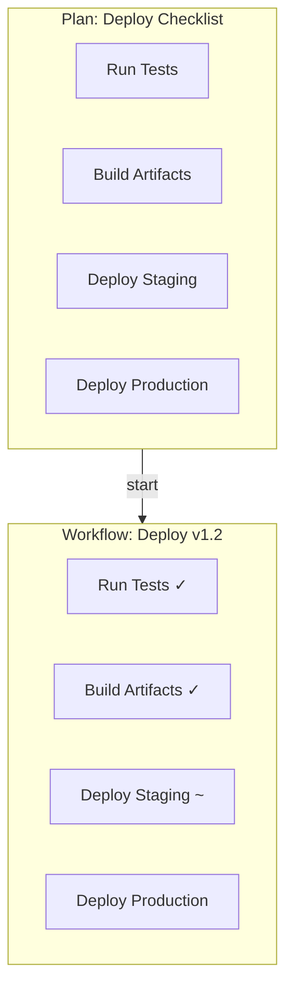

# Core Concepts Overview

TrakFlow is built around a few key concepts that work together to provide flexible task management.

## The Task Model

Everything in TrakFlow is a **Task**. Tasks serve multiple roles depending on their flags:



| Role | Identification | Description |
|------|----------------|-------------|
| **Task** | Default | A unit of work to be completed |
| **Plan** | `task.plan? == true` | A reusable workflow blueprint |
| **Step** | Child of a Plan | A task definition within a Plan |
| **Workflow** | `task.source_plan_id` set | A running instance of a Plan |
| **Work Item** | Child of a Workflow | A task within a running Workflow |

## Task Lifecycle



### Statuses

| Status | Description |
|--------|-------------|
| `open` | Ready to work on |
| `in_progress` | Currently being worked on |
| `blocked` | Waiting on something |
| `deferred` | Postponed for later |
| `closed` | Completed |
| `tombstone` | Archived (permanent) |
| `pinned` | Highlighted for visibility |

## Dependency Graph

Tasks can depend on other tasks. TrakFlow maintains a dependency graph to:

1. **Track blockers** - Know what's preventing work
2. **Find ready work** - Identify tasks with no open blockers
3. **Visualize relationships** - Understand task connections



### Dependency Types

| Type | Description |
|------|-------------|
| `blocks` | Hard dependency (default) |
| `related` | Soft link for reference |
| `parent-child` | Hierarchical relationship |
| `discovered-from` | Traceability link |

## Plans and Workflows

Plans are reusable workflow templates. When executed, they create Workflows.



### Workflow Types

| Type | Created By | Lifecycle | JSONL Export |
|------|------------|-----------|--------------|
| **Persistent** | `tf plan start` | Kept forever | Yes |
| **Ephemeral** | `tf plan execute` | Auto-cleaned | No |

## Labels

Labels provide flexible categorization:

```bash
tf label add tf-abc123 "frontend"
tf label add tf-abc123 "urgent"
tf label add tf-abc123 "v2.0"
```

Labels can represent:
- **Components**: `frontend`, `backend`, `api`
- **Priority markers**: `urgent`, `quick-win`
- **Versions**: `v1.0`, `v2.0`
- **States**: `needs-review`, `blocked-external`

## Data Storage

TrakFlow uses a dual-storage approach:

```
.trak_flow/
├── issues.jsonl    # Source of truth (git-tracked)
├── trak_flow.db    # Fast cache (gitignored)
└── config.json     # Settings (git-tracked)
```

### JSONL Format

Human-readable, one task per line:

```json
{"id":"tf-abc123","title":"Fix bug","status":"open","priority":1}
{"id":"tf-def456","title":"Add feature","status":"in_progress","priority":2}
```

### SQLite Cache

Provides:
- **Fast queries** - Millisecond response times
- **Indexing** - By status, priority, labels
- **Full-text search** - Search task content

The cache is rebuilt automatically from JSONL on each session.

## Hash-Based IDs

TrakFlow generates IDs using content hashes:

```
tf-a1b2c3d4
```

Benefits:
- **No collisions** - Multiple agents can create tasks simultaneously
- **Merge-friendly** - Git merges work without conflicts
- **Deterministic** - Same content = same ID (for deduplication)

## Next Steps

- [Tasks](tasks.md) - Deep dive into task properties
- [Plans & Workflows](plans-workflows.md) - Workflow automation
- [Dependencies](dependencies.md) - Managing task relationships
