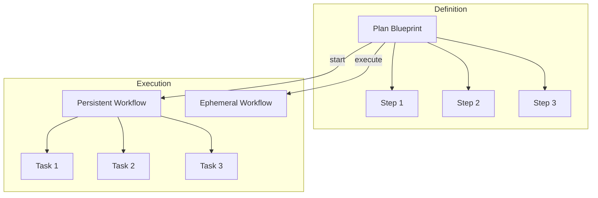

# Plans & Workflows

Plans and Workflows enable reusable, automated task sequences.

## Concept Overview



| Concept | Description |
|---------|-------------|
| **Plan** | A reusable template defining a sequence of tasks |
| **Step** | A task definition within a Plan |
| **Workflow** | A running instance created from a Plan |
| **Work Item** | A task within a Workflow |

## Creating Plans

### Create an Empty Plan

```bash
tf plan create "Deploy to Production"
```

### Add Steps

```bash
tf plan add tf-plan1 "Run test suite"
tf plan add tf-plan1 "Build Docker image"
tf plan add tf-plan1 "Deploy to staging"
tf plan add tf-plan1 "Run smoke tests"
tf plan add tf-plan1 "Deploy to production"
```

### View Plan

```bash
tf plan show tf-plan1
```

Output:

```
Plan: Deploy to Production [tf-plan1]
Status: open (blueprint)
Steps: 5

  [ ] Run test suite
  [ ] Build Docker image
  [ ] Deploy to staging
  [ ] Run smoke tests
  [ ] Deploy to production
```

### Convert Existing Task to Plan

```bash
tf plan convert tf-existing-task
```

## Executing Workflows

### Persistent Workflow

Creates a workflow that is kept in history:

```bash
tf plan start tf-plan1
```

- Exported to JSONL
- Appears in `tf workflow list`
- Kept after completion

### Ephemeral Workflow

Creates a one-shot workflow:

```bash
tf plan execute tf-plan1
```

- NOT exported to JSONL
- Auto-cleaned after completion
- Use for temporary operations

## Managing Workflows

### List Workflows

```bash
# All workflows
tf workflow list

# Only ephemeral
tf workflow list --ephemeral
tf workflow list -e
```

### View Workflow

```bash
tf workflow show tf-wf1
```

Output:

```
Workflow: Deploy to Production [tf-wf1]
Source Plan: tf-plan1
Type: Persistent
Status: in_progress

  [x] Run test suite
  [x] Build Docker image
  [~] Deploy to staging
  [ ] Run smoke tests
  [ ] Deploy to production

Progress: 2/5 completed
```

### Work on Tasks

```bash
# Start a task
tf start tf-task1

# Complete a task
tf close tf-task1
```

### Summarize and Close

When all tasks are done:

```bash
tf workflow summarize tf-wf1 --summary "Deployed v1.2.0 successfully"
```

This:
1. Adds the summary to workflow notes
2. Closes the workflow
3. Records completion timestamp

### Discard Ephemeral Workflow

```bash
tf workflow discard tf-wf1
```

Only ephemeral workflows can be discarded.

## Garbage Collection

Clean up old ephemeral workflows:

```bash
tf workflow gc
```

This removes ephemeral workflows that are:
- Closed
- Older than the retention period

## Plan vs Workflow Properties

| Property | Plan | Workflow |
|----------|------|----------|
| `plan` | `true` | `false` |
| `source_plan_id` | `null` | Set to Plan ID |
| `ephemeral` | Always `false` | `true` or `false` |
| `status` | Always `open` | Can change |
| Contains | Steps (templates) | Work items (tasks) |
| JSONL export | Yes | Persistent only |

## Use Cases

### Release Checklist

```bash
tf plan create "Release Checklist"
tf plan add tf-plan1 "Update version number"
tf plan add tf-plan1 "Update CHANGELOG"
tf plan add tf-plan1 "Run full test suite"
tf plan add tf-plan1 "Create release branch"
tf plan add tf-plan1 "Build release artifacts"
tf plan add tf-plan1 "Deploy to staging"
tf plan add tf-plan1 "QA verification"
tf plan add tf-plan1 "Deploy to production"
tf plan add tf-plan1 "Create GitHub release"
tf plan add tf-plan1 "Announce release"
```

### Code Review Process

```bash
tf plan create "Code Review"
tf plan add tf-plan1 "Check code style"
tf plan add tf-plan1 "Review logic"
tf plan add tf-plan1 "Check test coverage"
tf plan add tf-plan1 "Security review"
tf plan add tf-plan1 "Performance review"
tf plan add tf-plan1 "Approve or request changes"
```

### Onboarding Workflow

```bash
tf plan create "New Team Member Onboarding"
tf plan add tf-plan1 "Create accounts"
tf plan add tf-plan1 "Grant repository access"
tf plan add tf-plan1 "Add to Slack channels"
tf plan add tf-plan1 "Schedule intro meetings"
tf plan add tf-plan1 "Assign onboarding buddy"
tf plan add tf-plan1 "First task assignment"
```

## Best Practices

### Plan Design

1. **Keep steps atomic** - Each step should be completable independently
2. **Use clear names** - Steps should be self-explanatory
3. **Order logically** - Steps should follow a natural sequence
4. **Consider dependencies** - Add explicit dependencies if needed

### Workflow Execution

1. **Use persistent for auditing** - When you need a record
2. **Use ephemeral for routine** - For repeatable, disposable operations
3. **Summarize on completion** - Document what happened
4. **Clean up regularly** - Run `tf workflow gc` periodically

### Error Handling

```bash
# If a step fails, mark it blocked
tf block tf-step3

# Add notes about the issue
tf update tf-step3 --notes "Staging deployment failed, investigating"

# Once resolved, restart
tf start tf-step3
```
