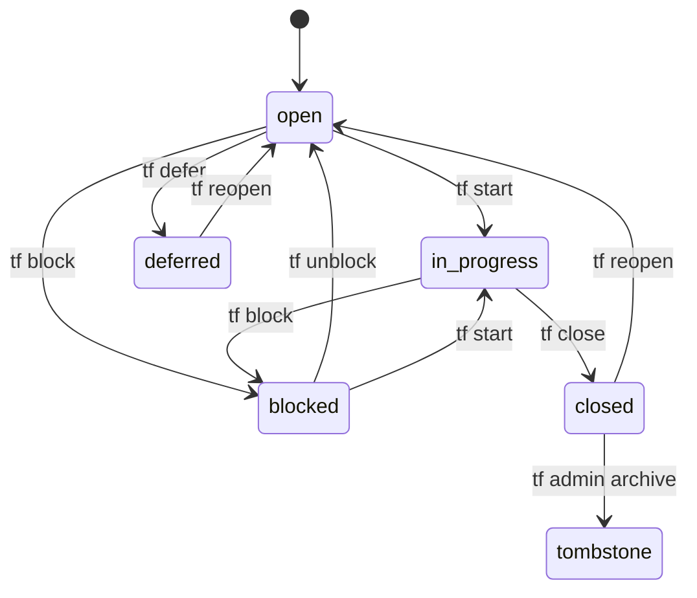

# Tasks

Tasks are the fundamental unit in TrakFlow. This page covers task properties and behavior in detail.

## Task Properties

| Property | Type | Required | Description |
|----------|------|----------|-------------|
| `id` | string | Auto | Unique identifier (e.g., `tf-abc123`) |
| `title` | string | Yes | Short description of the task |
| `description` | string | No | Detailed description |
| `status` | string | No | Current status (default: `open`) |
| `priority` | integer | No | Priority level 0-4 (default: `2`) |
| `type` | string | No | Task type (default: `task`) |
| `assignee` | string | No | Assigned user/agent |
| `parent_id` | string | No | Parent task for hierarchy |
| `created_at` | datetime | Auto | Creation timestamp |
| `updated_at` | datetime | Auto | Last update timestamp |
| `closed_at` | datetime | Auto | When task was closed |
| `notes` | string | No | Free-form notes and trace log |

### Plan/Workflow Properties

| Property | Type | Description |
|----------|------|-------------|
| `plan` | boolean | True if this is a Plan blueprint |
| `source_plan_id` | string | ID of Plan this Workflow was created from |
| `ephemeral` | boolean | True if this is a one-shot workflow |

## Task Types

| Type | Description | Use Case |
|------|-------------|----------|
| `task` | General task | Default for most work items |
| `bug` | Bug fix | Defect tracking |
| `feature` | New feature | Feature development |
| `epic` | Large initiative | Container for related tasks |
| `chore` | Maintenance | Technical debt, cleanup |

### Creating Different Types

```bash
tf create "Fix null pointer exception" -t bug
tf create "Add OAuth support" -t feature
tf create "User Management" -t epic
tf create "Update dependencies" -t chore
```

## Priority Levels

| Level | Name | Color | Description |
|-------|------|-------|-------------|
| 0 | Critical | Red Bold | Urgent, drop everything |
| 1 | High | Red | Important, do soon |
| 2 | Medium | Yellow | Normal priority (default) |
| 3 | Low | Blue | Do when time permits |
| 4 | Backlog | Gray | Future consideration |

### Setting Priority

```bash
tf create "Security vulnerability" -p 0
tf create "Nice to have feature" -p 4
tf update tf-abc123 --priority 1
```

## Task Statuses

### Status Flow



### Status Commands

```bash
tf start tf-abc123      # open → in_progress
tf block tf-abc123      # → blocked
tf defer tf-abc123      # → deferred
tf close tf-abc123      # → closed
tf reopen tf-abc123     # → open
```

## Hierarchical Tasks

Tasks can have parent-child relationships for organization.

### Creating Child Tasks

```bash
# Create parent
tf create "User Authentication" -t epic

# Create children
tf create "Login page" --parent tf-auth1
tf create "Logout functionality" --parent tf-auth1
tf create "Password reset" --parent tf-auth1
```

### Viewing Hierarchy

```bash
tf show tf-auth1 --tree
```

Output:

```
[tf-auth1] User Authentication (epic)
├── [tf-login] Login page (task)
├── [tf-logout] Logout functionality (task)
└── [tf-reset] Password reset (task)
```

## Content Hash

Each task has a `content_hash` that:

1. **Detects changes** - Know when content was modified
2. **Enables deduplication** - Identify identical tasks
3. **Supports sync** - Merge changes from multiple sources

The hash is computed from all properties except `updated_at` and `content_hash` itself.

## Notes and Trace Log

The `notes` field stores free-form text and automatic trace entries:

```bash
tf update tf-abc123 --notes "Waiting for design review"
```

Automatic trace entries are added for state changes:

```
[2024-01-15T10:30:00Z] [CLOSED] Implemented in PR #42
[2024-01-14T09:00:00Z] [STARTED] Beginning implementation
[2024-01-13T14:00:00Z] [CREATED] Initial task creation
```

## Validation Rules

Tasks are validated on creation and update:

| Rule | Error |
|------|-------|
| Title required | "Title is required" |
| Valid status | "Invalid status: {status}" |
| Valid priority | "Invalid priority: {priority}" |
| Valid type | "Invalid type: {type}" |
| Plans can't be ephemeral | "Plans cannot be ephemeral" |
| Plans stay open | "Plans cannot change status" |
| Plans can't derive from Plans | "Plans cannot be derived from other Plans" |

## JSON Representation

```json
{
  "id": "tf-abc123",
  "title": "Implement feature X",
  "description": "Detailed description here",
  "status": "in_progress",
  "priority": 1,
  "type": "feature",
  "assignee": "claude",
  "parent_id": null,
  "created_at": "2024-01-15T10:00:00Z",
  "updated_at": "2024-01-15T14:30:00Z",
  "closed_at": null,
  "content_hash": "a1b2c3d4",
  "plan": false,
  "source_plan_id": null,
  "ephemeral": false,
  "notes": ""
}
```

## Task Predicates

In Ruby code, tasks expose these predicate methods:

```ruby
task.open?        # status == "open"
task.closed?      # status == "closed" or "tombstone"
task.in_progress? # status == "in_progress"
task.blocked?     # status == "blocked"
task.epic?        # type == "epic"
task.plan?        # plan == true
task.workflow?    # source_plan_id present and not a plan
task.ephemeral?   # ephemeral == true
task.executable?  # not a plan (can be executed)
task.discardable? # ephemeral (can be discarded)
```
