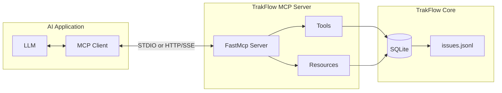

# MCP Server Overview

TrakFlow includes a Model Context Protocol (MCP) server that allows AI agents and LLM-powered applications to interact with your task data.

## What is MCP?

The [Model Context Protocol](https://modelcontextprotocol.io/) is an open standard for connecting AI applications to external data sources and tools. TrakFlow's MCP server exposes:

- **Tools** - Actions agents can perform (create, update, list tasks)
- **Resources** - Data agents can read (task lists, dependencies)

## Quick Start

### STDIO Transport (Recommended for Local Use)

```ruby
require 'trak_flow'
require 'trak_flow/mcp'

# Start the MCP server over STDIO
TrakFlow::Mcp::Server.new.run
```

### HTTP/SSE Transport (For Remote Access)

```ruby
require 'trak_flow'
require 'trak_flow/mcp'

# Start with HTTP/SSE transport
server = TrakFlow::Mcp::Server.new
server.run_http(port: 9292)
```

## Architecture



## Transport Options

### STDIO Transport

Best for:
- Local development
- IDE integrations (VS Code, Cursor)
- Single-user setups
- Command-line tools

Communication happens through standard input/output streams.

### HTTP/SSE Transport

Best for:
- Remote access
- Multi-client scenarios
- Web applications
- API integrations

Uses HTTP for requests and Server-Sent Events (SSE) for real-time updates.

## Available Tools

| Tool | Description |
|------|-------------|
| `task_create` | Create a new task |
| `task_list` | List tasks with filters |
| `task_show` | Get task details |
| `task_update` | Modify a task |
| `task_start` | Begin working on a task |
| `task_close` | Complete a task |
| `task_block` | Mark as blocked |
| `task_reopen` | Reopen a closed task |
| `plan_create` | Create a Plan blueprint |
| `plan_start` | Start a Workflow |
| `dep_add` | Add dependency |
| `dep_remove` | Remove dependency |
| `label_add` | Add label to task |
| `label_remove` | Remove label |

## Available Resources

| Resource | URI | Description |
|----------|-----|-------------|
| Task List | `trak_flow://tasks` | All tasks |
| Ready Tasks | `trak_flow://ready` | Tasks with no blockers |
| Dependencies | `trak_flow://dependencies` | Dependency graph |
| Plans | `trak_flow://plans` | Plan blueprints |
| Labels | `trak_flow://labels` | All labels |

## Integration Examples

### With Claude Desktop

Add to your Claude Desktop configuration:

```json
{
  "mcpServers": {
    "trak_flow": {
      "command": "tf",
      "args": ["mcp", "start"],
      "cwd": "/path/to/your/project"
    }
  }
}
```

### With VS Code

If using an MCP-enabled VS Code extension:

```json
{
  "mcp.servers": {
    "trak_flow": {
      "command": "tf",
      "args": ["mcp", "start"]
    }
  }
}
```

### With Ruby LLM

```ruby
require 'ruby_llm'
require 'ruby_llm/mcp'

# Connect to TrakFlow MCP server
client = RubyLLM::MCP::Client.new(
  transport_type: :stdio,
  command: ["tf", "mcp", "start"],
  working_dir: "/path/to/project"
)

# Use tools
create_tool = client.tool("task_create")
result = create_tool.execute(
  title: "New task from AI",
  priority: 1
)
```

## Security Considerations

### File System Access

The MCP server only accesses:
- `.trak_flow/` directory in the working directory
- SQLite database file
- JSONL data file

### Authentication

Currently, the MCP server does not implement authentication. For production use:

1. Run behind a reverse proxy with authentication
2. Use network-level access controls
3. Consider implementing custom middleware

### Data Privacy

- Task data stays local
- No external API calls
- No telemetry or analytics

## Configuration

Environment variables:

| Variable | Description | Default |
|----------|-------------|---------|
| `TRAK_FLOW_DIR` | Data directory | `.trak_flow` |
| `TRAK_FLOW_MCP_PORT` | HTTP port | `9292` |
| `TRAK_FLOW_MCP_HOST` | HTTP host | `127.0.0.1` |

## Next Steps

- [Tools Reference](tools.md) - Detailed tool documentation
- [Resources Reference](resources.md) - Available resources
- [Integration Guide](integration.md) - Integration examples
